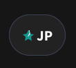

import { Tabs, TabItem } from '@astrojs/starlight/components';

## Why Freespoke Premium?

Freespoke Premium provides a number of benefits. With Premium, you get access to
special features unavailable to other users such as the ability to block sites
forever from your search results. You'll also never see an ad, either in our
news feed, or in your search results. With Premium enabled in our mobile apps
for Android and iOS, you automatically get our ad blocker that prevents you from
seeing annoying ads on every site you visit.

Freespoke Premium is also the best way that you have to support our mission.
When we started Freespoke, we decided up front that we were going to break,
well, all the rules. Traditional Big Tech search monitors your activity across
the entire internet. It tracks everything you do, and builds profiles of you in
order to offer access to your eyeballs to advertisers and data brokers.
Traditional Big Tech search is biased. Sometimes purposefully, sometimes
accidentally, but biased nonetheless. Freespoke is very intentionally unbiased.
Tradition Big Tech search is a minefield for your kids. Sure, there's a safe
search option, but it's extremely lax by default, hard to find, and unenforcable.
Freespoke simply doesn't index or display pornographic videos, images, or web
links. Unlike Big Tech, Freespoke is a partner in protecting kids online.

Building a search engine is hard work. Building a search engine that puts your
interests ahead of the interests of advertisers and data brokers is harder yet.
It's not just hard -- it's expensive. Your Freespoke Premium subscription allows
us to continue our work creating a private, unbiased, porn-free search engine.

## Getting Premium

### Signing up on Freespoke's Website

To learn how to get Freespoke Premium, choose the tab below which reflects your
situation for specific, detailed instructions.

To get Freespoke Premium, visit our <a href="https://freespoke.com/premium/subscribe" target="_blank">Premium Signup Page</a>.
If you are not logged into your account, you will be prompted to enter create an
account. Enter your first and last name, email, and choose a password. If you've
registered in the past, click the "Log In" link to log back in to your account.

Next, choose your plan. We offer Monthly and Annual payment options. If you have
a promo code, enter it by clicking the "Redeem Promo Code" button.

Enter your billing information, and submit.

### Signing up in Freespoke's Mobile App

<Tabs>
    <TabItem label="iOS" icon="apple">
        Install the Freespoke App from the <a href="https://apps.apple.com/app/freespoke/id1617332602" target="_blank">Apple App Store</a>
    </TabItem>
    <TabItem label="Android" icon="uil-android">
        Install the Freespoke App from the <a href="https://play.google.com/store/apps/details?id=com.freespoke" target="_blank">Google Play Store</a>
    </TabItem>
</Tabs>

## Checking Your Premium Status

If you have an active subscription to Freespoke Premium, you will see a star icon
in your user bubble at the top of every page on Freespoke, or at the top of your
homepage in the Freespoke App.

## Managing Your Subscription

To manage your subscription, visit your Account Settings page by clicking your
user bubble at the top of the page, or click <a href="https://freespoke.com/account/profile" target="_blank">here</a>.

From the Freespoke Mobile app's homepage, tap your user bubble, then tap the
"Account" menu item.

Choose "Freespoke Premium" from the Account Settings menu. On this screen, you
will see your current subscription plan and your next billing date. Click or tap
on "Manage" to change your billing information or cancel your subscription.

## Getting Help

For any questions or for technical support, send us an email at
help@freespoke.com, or visit our <a href="https://freespoke.com/help" target="_blank">support site</a>
and create a ticket with our helpdesk.