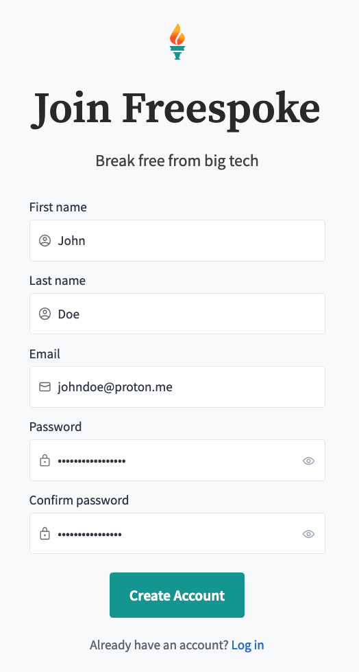
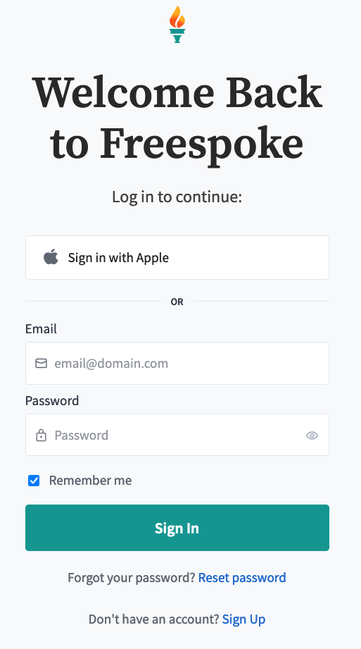
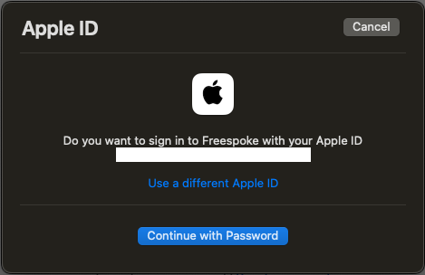
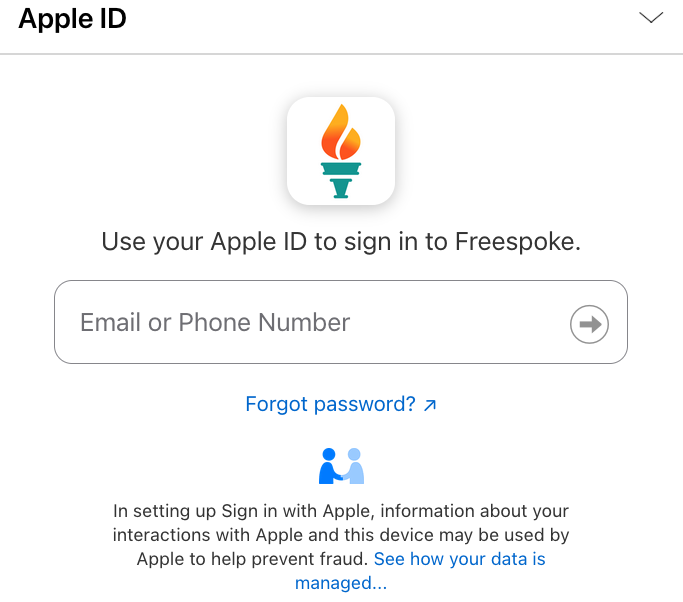

import { Aside, Tabs, TabItem } from '@astrojs/starlight/components';

Your account is your gateway to many Freespoke features. It's the gateway to
[Freespoke Premium](/account/get-premium), and a way to support Freespoke's mission
of unbiased, private, porn-free search that puts humans first.

<Aside type="tip">
  Freespoke Accounts are and will always be 100% free of charge. While we'd love
  to have you consider [Freespoke Premium](/account/get-premium) as well, you
  will never be charged for signing up for a Freespoke Account.
</Aside>

## Sign Up

You can create an account using your email address, or by connecting your Apple ID.

<Tabs>
  <TabItem label="Email Sign Up" icon="email">
    To join Freespoke using your email and a password, visit our <a href="https://freespoke.com/signup" target="_blank">registration page</a>.

    Complete the form fields (all are required!) and click "Create Account".

    <Aside type="tip" title="Password Requirements">
        Both password fields must match in order to continue, and your password
        must meet some minimum criteria for strength:

        * At least 8 characters long.
        * At least one number and uppercase character.
        * May not be the same as your email.
    </Aside>

    <Aside type="danger" title="Password Tips">
        * Do not share your password with anyone.
        * Do not reuse the same password on Freespoke as on any other site or account.
        * We highly recommend a password manager to secure your online accounts. Freespoke recommends 1Password.
    </Aside>

    
  </TabItem>
  <TabItem label="Apple ID Sign Up" icon="apple">
    To join Freespoke using your Apple ID, visit our <a href="https://freespoke.com/login" target="_blank">login page</a>.

    Click the "Sign in with Apple" button.

    

    If you are using Safari, you will see a pop-up asking that you confirm the
    login. Choosing to Continue will require confirmation with your password,
    Face ID, or Touch ID.

    

    On other browsers, you will be directed to an Apple sign-in page. Login using
    your Apple ID email and password.

    

    After confirmation, your account is created! You will be redirected back to
    Freespoke.
  </TabItem>
</Tabs>

## Login

To login to your Freespoke Account, visit our <a href="https://freespoke.com/login" target="_blank">login page</a>.

Sign in either by entering your registration email and password, or by choosing "Sign in with Apple".

## Forgot Password

If you have trouble signing in to your account, you can reset your password by visiting the
<a href="https://accounts.freespoke.com/realms/freespoke/login-actions/reset-credentials?client_id=public" target="_blank">reset password</a>
screen.

If after resetting your password, you are still unable to access your account,
send us an email at help@freespoke.com, or visit our <a href="https://freespoke.com/help" target="_blank">support site</a>
and create a ticket with our helpdesk.