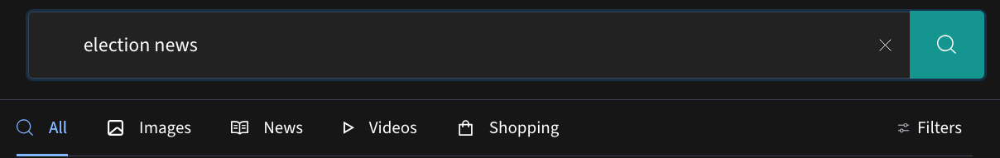
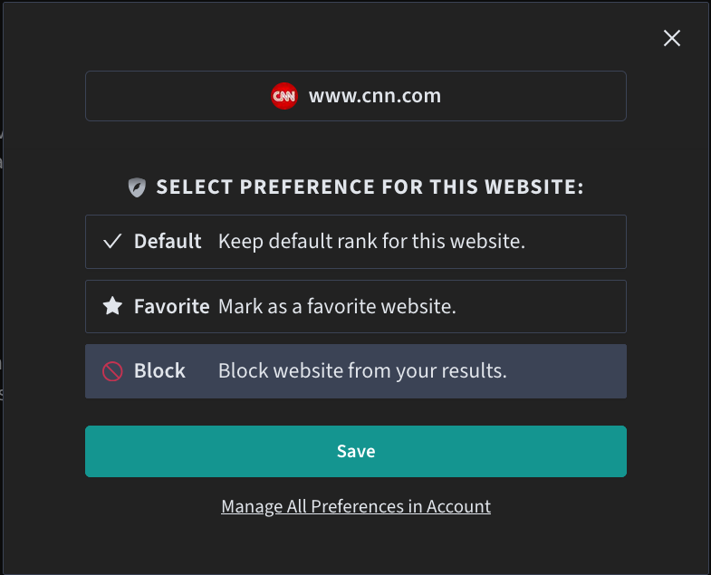
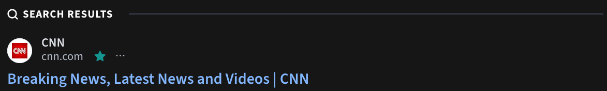

import { Aside } from '@astrojs/starlight/components';

Freespoke offers a number of options to customize your search results. Customization
can be done on search results page, or by changing your account's search settings.

## Search Result Filters

Freespoke allows you to filter results by political bias or by date.

Visit <a href="https://freespoke.com" target="_blank">Freespoke</a> and enter a
term into the search bar. Hit enter or tap the search button. Once results load,
tap the "Filters" button just below the search bar. Drop downs will appear
allowing you to filter by the date at which the content was published, or by the
political bias of the publisher. Visit our [Bias](/about/bias) page to learn
more about how Freespoke rates publisher bias.

## Account-Level Filters

### Website Blacklist And Favorite List

<Aside type="tip">
    This feature requires an account with an active subscription to [Freespoke Premium](/account/get-premium).
</Aside>

Freespoke allows you to permanently block search results from sites you dislike, or to mark as favorites sites you particularly like.

To block a site, first ensure that you are [logged in](/account/login-register/#login) to your Freespoke Account with
Freespoke Premium.

On the Search Results page, tap the <svg style="display:inline" xmlns="http://www.w3.org/2000/svg" width="16" height="14" fill="none"><path fill="#B5BCC9" d="M4.741 13.639c-1.627-1.698-.02-4.378-.02-4.378l1.904-3.276A4.71 4.71 0 0 0 5.533 0L3.884 2.831 1.336 7.092C-.288 9.833.276 12.74 4.613 13.846a.124.124 0 0 0 .128-.207"></path><path fill="url(#flame-plus-darkmode-icon_svg__a)" fill-opacity="0.3" d="M4.741 13.639c-1.627-1.698-.02-4.378-.02-4.378l1.904-3.276A4.71 4.71 0 0 0 5.533 0L3.884 2.831 1.336 7.092C-.288 9.833.276 12.74 4.613 13.846a.124.124 0 0 0 .128-.207"></path><path fill="#B5BCC9" d="M5.564 14c-.697-1.28-.466-2.837.432-4.346l2.278-3.67.394.3a3.85 3.85 0 0 1 .983 5.087l-.05.081A5.72 5.72 0 0 1 5.572 14z"></path><path fill="url(#flame-plus-darkmode-icon_svg__b)" fill-opacity="0.3" d="M5.564 14c-.697-1.28-.466-2.837.432-4.346l2.278-3.67.394.3a3.85 3.85 0 0 1 .983 5.087l-.05.081A5.72 5.72 0 0 1 5.572 14z"></path><path fill="#B5BCC9" d="M10.69 2.986a3 3 0 0 1-2.12.879v.461a3 3 0 0 1 3 3h.461a3 3 0 0 1 3-3v-.461a3 3 0 0 1-3-3h-.462a3 3 0 0 1-.878 2.12"></path><path fill="url(#flame-plus-darkmode-icon_svg__c)" fill-opacity="0.3" d="M10.69 2.986a3 3 0 0 1-2.12.879v.461a3 3 0 0 1 3 3h.461a3 3 0 0 1 3-3v-.461a3 3 0 0 1-3-3h-.462a3 3 0 0 1-.878 2.12"></path><defs><linearGradient id="flame-plus-darkmode-icon_svg__a" x1="5.357" x2="5.357" y1="0" y2="14" gradientUnits="userSpaceOnUse"><stop></stop><stop offset="1" stop-opacity="0"></stop></linearGradient><linearGradient id="flame-plus-darkmode-icon_svg__b" x1="5.357" x2="5.357" y1="0" y2="14" gradientUnits="userSpaceOnUse"><stop></stop><stop offset="1" stop-opacity="0"></stop></linearGradient><linearGradient id="flame-plus-darkmode-icon_svg__c" x1="11.8" x2="11.8" y1="0.865" y2="7.326" gradientUnits="userSpaceOnUse"><stop></stop><stop offset="1" stop-opacity="0"></stop></linearGradient></defs></svg> icon.

To blacklist a site, removing it from all search results, select "Block" from the options and tap Save.

To favorite a site, select "Favorite" and tap Save.

#### Favorite Sites

Favorites are indicated on search result pages with a special style:

#### Managing Site Preferences

To view or manage your account's site preferences, visit your <a href="https://freespoke.com/account/profile/filters" target="_blank">Advanced Search Filters</a>
preferences page. To access this page from Freespoke.com, tap your user bubble
in the top-right corner of Freespoke, then choose "Advanced Search Filters" from
the sidebar.

You can add additional sites from the page by typing a URL or domain into the
"New Search Filter" field and choosing whether to Favorite or Block it from the
"Result Priority" dropdown.

You can view, edit, or remove existing search rules from the "Existing Rules"
list. For instance, in the above screenshot, you could change "cnn.com" from
Favorite to Blocked, or tap the "x" to remove the filter entirely.